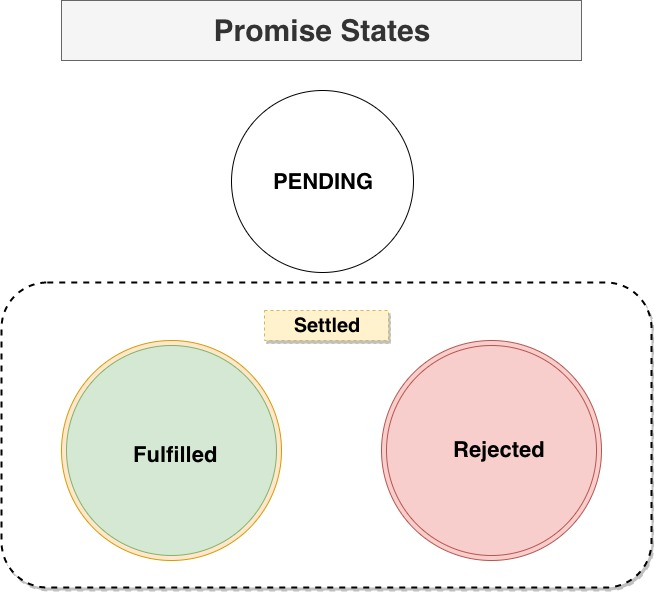

## Promises

- Promises are readability enhancer where a special object gets returned immediatly when we make a call to browser API.

- When you are using `setTimeout` in javascript it doesn't do anything in `js` it does everything in the browser apis.

- Promises act as a placeholder for the data we hope to get back in future.

- We attach a function to run once data is loaded using `then` method.

- We can also attach error handeling using `catch` method.

- `then` or `catch` return a promise.

## Promise States



- **Promise can be on of these three promise states.**
  1. In start the promise is pending
  2. If the result is availabel its fulfilled
  3. If something goes wrong and an error happened promise is Rejected.
  4. Once a promise is fulfilled it's state will not change.

## Promise Example

```js
function delayAction() {
  new Promise().then();
}
```

1. When we specify `then` method on promise we can specify two handlers. `onFulfilled` and `onRejected` handler.

```js
// Creating a promise
var promise = new Promise();

// Settle the promise (pending, fulfilled and rejected)
var promise = new Promise((res, rej) => res()); // resolved
var promise = new Promise((res, rej) => rej()); // rejected

//  You can add a `then` or `catch` on promises to handle the data.

promise.then(res => console.log(res)); // handling the resolved state
promise.catch(err => console.log(err)); // handeling the rejected state
```

Promise object will automatically trigger that functionality to run.

```javascript
function display(d) {
  console.log(d);
}
function sayHello() {
  console.log("Hey");
}
function delayForSeconds(sec) {
  let start = Date.now(),
    now = start;
  while (now - start < sec * 1000) {
    now = Date.now();
  }
}
setTimeout(sayHello, 0);

const fetchData = fetch("https://api.github.com/users/getify");

fetchData.then(display);
delayForSeconds(5);
console.log("Again!!");
```

## Microtask Queue / Job Queue

Any function which uses the web browser api and returns a promise object are pushed to microtask queue.

Example
Guess the output of the following

```javascript
console.log("start");
setTimeout(() => console.log("setTimeout"), 0);
Promise.resolve()
  .then(() => console.log("Promise 1"))
  .then(() => console.log("Promise 2"));
console.log("ends");
```

Guess the output:

```js
const xhr = new XMLHttpRequest();
xhr.addEventListener("load", () => console.log(xhr.response.login));
xhr.open("GET", "https://api.github.com/users/nnnkit");
xhr.send();
fetch("https://api.github.com/users/getify")
  .then(res => res.json())
  .then(d => console.log(d.login));
```
